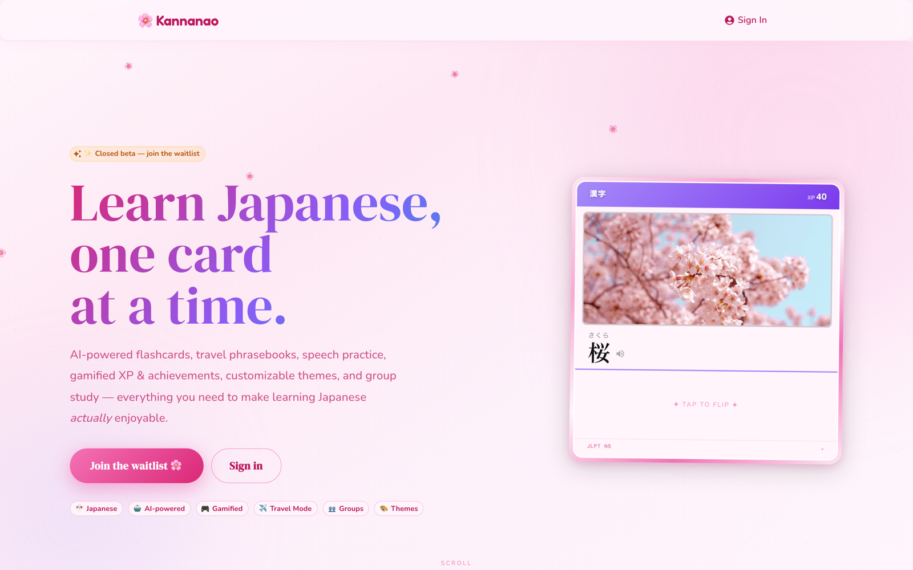

<div align="center">

# 🌸 Kannanao

### AI-powered Japanese flashcard studio

Spaced practice, gamification, speech memorization, and group study — everything you need to make learning Japanese _actually_ enjoyable. Built for and used by a real base of language learners.

[](https://kannanao.com)




</div>

## What it does

- **AI card generation** — paste words in any language or upload a PDF; Gemini generates readings, meanings, example sentences with furigana, and image suggestions
- **Four practice modes** — Flashcard study, Match (timed pairing), Fill-in-the-blank (typing), and Recall (multiple choice)
- **Speech memorization** (Ohanashikai) — upload scripts line-by-line, practice with read-through and line-recall modes
- **Gamification** — XP, levels, streaks, achievements, and a cosmetic shop (card borders, study buddies, themes)
- **Deck sharing** — share decks with other users or embed them publicly via iframe
- **Group management** — organizer/member accounts with QR code invites, group dashboard, study assignments, encouragement messages, weekly leaderboard, and activity feed
- **To-do tracker** — recurring task system with calendar view, integrated into the home page
- **10 color themes** — each with its own font pairing and design tokens

## Architecture

```
src/
├── app/             # Next.js App Router (pages + API routes)
│   ├── api/         # Gemini, Unsplash, PDF extraction, public deck endpoints
│   ├── api/group/   # Group management: invites, members, assignments, encouragements, leaderboard, feed
│   ├── group/       # Organizer group dashboard page
│   └── join/        # Public invite join page
├── components/      # React components (each folder ≤300 lines per file)
│   └── Group/       # GroupOverview, MemberCard, MemberDetail, LeaderboardWidget, etc.
├── contexts/        # Auth (with account roles), XP animation, card border, theme providers
├── hooks/           # Data-fetching hooks with optimistic updates
├── lib/             # Supabase client, DB adapters, logger, utilities
├── services/        # API client functions
├── theme/           # MUI theme with 10 color scheme definitions
└── types/           # Shared TypeScript interfaces
```

**Data flow**: Components call hooks → hooks call Supabase directly (reads) or API routes (AI generation, group management) → hooks expose optimistic state + rollback on error.

**API routes** are thin wrappers around external services (Gemini, Unsplash, Supabase Storage). Each route has input validation (Zod), rate limiting, and structured logging. Group API routes use a service role Supabase client to bypass RLS and `requireOrganizerAccount()` for auth gating.

## Tech stack

| Layer     | Choice                                      | Why                                                                                       |
| --------- | ------------------------------------------- | ----------------------------------------------------------------------------------------- |
| Framework | Next.js 15 (App Router)                     | Server components for initial load, client components for interactivity                   |
| UI        | MUI 7 + `sx` prop                           | Consistent design system with theme tokens; avoids CSS-in-JS runtime overhead via Emotion |
| Database  | Supabase (Postgres + Auth + Storage)        | Auth, real-time subscriptions, and row-level security in one service                      |
| AI        | Google Gemini (Flash)                       | Structured JSON output for flashcard generation; cost-effective for per-card inference    |
| Images    | Unsplash API                                | Free-tier image search with proper attribution                                            |
| Testing   | Vitest + React Testing Library + Playwright | Unit tests for hooks/utils, E2E smoke tests for critical flows                            |
| Hosting   | Vercel                                      | Zero-config deployment for Next.js; edge functions for API routes                         |

## Local development

```bash
# Prerequisites: Node 20+, pnpm
pnpm install

# Set up environment variables (see .env.example or create .env.local)
# Required: NEXT_PUBLIC_SUPABASE_URL, NEXT_PUBLIC_SUPABASE_ANON_KEY
# Required for group features: SUPABASE_SERVICE_ROLE_KEY
# Optional: GEMINI_API_KEY, UNSPLASH_ACCESS_KEY

pnpm dev          # Start dev server on :3000
pnpm build        # Production build
pnpm lint         # ESLint
pnpm test:run     # Unit tests (single run)
pnpm test:summary # Tests with coverage summary
pnpm test:e2e     # Playwright E2E tests (requires dev server running)
```

A Husky pre-push hook runs `format:check`, `lint`, `tsc --noEmit`, and `test:run` before every push.

## Group system

Kannanao supports **organizer** and **member** account types. Organizers have full access and can create invite codes (displayed as QR codes) to onboard members. Members get a focused study experience — they can practice shared decks, earn XP, and view leaderboards, but cannot access AI generation or create decks.

Key features:

- **QR invite flow** — organizers generate invite codes; members scan/visit a join link to create their account
- **Group dashboard** (`/group`) — organizer sees member progress, stats, achievements, and recent activity
- **Study assignments** — organizers assign decks with optional due dates; auto-completed when the member studies the deck
- **Encouragement messages** — organizers send motivational messages; members see them via a NavBar inbox
- **Weekly leaderboard** — toggleable per organizer, visible to the whole group

Database: 3 new tables (`invite_codes`, `assignments`, `encouragements`) and 3 new columns on `profiles` (`account_type`, `organizer_id`, `show_leaderboard`). Migration: `supabase/migrations/20260426000000_add_group_system.sql`.

## Trade-offs

**In-memory rate limiting** — The rate limiter uses a per-process `Map`, which resets on cold starts and doesn't share state across Vercel function instances. This is sufficient for the current scale (single-digit concurrent users) and avoids adding Redis as a dependency. If abuse becomes a problem, I'd move to Vercel KV or Upstash Redis.

**No SSR for authenticated pages** — All authenticated pages are client-rendered behind an `AuthGuard`. Supabase auth tokens live in the browser, so SSR would require cookie-based session management. The trade-off is a brief loading spinner on first load, which is acceptable for an app that users return to repeatedly.

**Flat hook architecture** — Each hook (`useDecks`, `useCards`, `useProgress`, etc.) manages its own Supabase queries and state. There's no global state manager (Redux, Zustand). This keeps hooks self-contained and testable but means some data is re-fetched across page navigations. At the current data volume (dozens of decks, hundreds of cards per user), this is fast enough.

**MUI over Tailwind** — MUI provides accessible, pre-built components (dialogs, snackbars, tooltips) that would take significant effort to replicate. The trade-off is a larger bundle size (~80KB gzipped for MUI core). For a feature-rich app with 10 theme variants, the component library pays for itself.

## What I'd do differently

- **Database migrations from day one** — The baseline migration was retroactively generated from TypeScript types. Starting with Supabase CLI migrations would have made schema changes reviewable and reversible.
- **Server-side sessions** — Cookie-based auth would enable SSR for authenticated pages, improving time-to-interactive and enabling server-side data fetching.
- **Storybook for component development** — With 10 themes and many component variants, visual regression testing would catch styling issues that unit tests miss.
- **Integration tests for AI generation** — The Gemini prompt is the most fragile part of the system. Snapshot tests for representative inputs would catch regressions in card quality.

## License

All rights reserved. See [LICENSE](./LICENSE).
